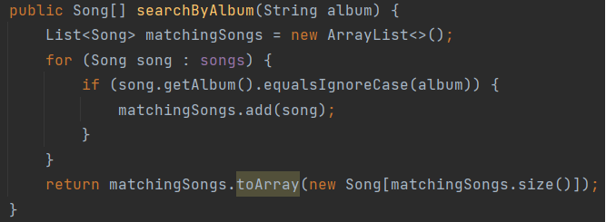
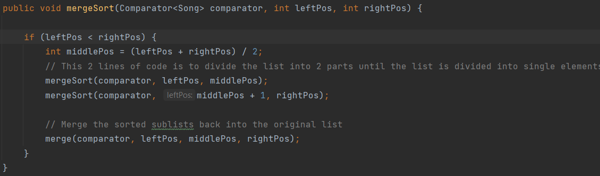
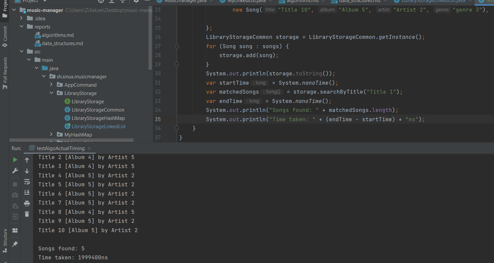

# Searching and Sorting Algorithms
## Context - Searching Algorithms
There are 3 types of searching algorithms that we have studied which are Linear Search, Binary Search and Jump Search.
Requirement : Binary Search and Jump Search require the data to be sorted in order to work. Whereas Linear Search does not.

**Choosen algorithm: Linear Search**
The searching algorithm that I have implemented in the project is Linear Search.
The reason for choosing this algorithm is that it is the simplest algorithm among the 3 searching algorithms.
The best thing about linear search is it can deal with unsorted data and not even have to maintain the data in a sorted order.
Also, maintaining the data in a sorted order is a very expensive operation.

## Context - Sorting Algorithms
There are 4 types of sorting algorithms that we have studied which are Bubble Sort, Selection Sort, Merge Sort and Quick Sort.
Merge sort and Quick sort are better option than Bubble sort and Selection sort as they have better time complexity.
But when it comes to space complexity, Merge sort and Quick sort are not the best option as they require extra space to store the data.
Because Bubble sort and Selection sort have n(1) of space complexity whereas Merge sort and Quick sort have n(log n).
Overall, Merge sort and Quick sort better Bubble sort and Selection sort.

**Choosen algorithm: Merge sort**
Merge Sort vs Quick Sort
- Merge sort is a stable algorithm whereas Quick sort is not. (The stability of an algorithm is important when it comes to sorting objects.)
- If memory is a concern, Quick sort would be the best option as it has a space complexity of n(1) whereas Merge sort has n(log n).
- if the pivot is not chosen properly, Quick sort can have a worst case time complexity of n^2

If the space complexity is not the primary concern, Merge sort would be the best option to sort the data.

I initially choose Selection Sort. The reason why i change my mind is because the time complexity is better. Although, Selection Sort sorts in place and is lighter in memory consumption.

## Algorithm explanation
**Searching algorithm - Linear Search**
The implemnetation is very simple. It just loops through the data and checks if the data is equal to the target value.

**Sorting Algorithms - Merge Sort**
The implementation of Merge sort is a bit complex. It uses the divide and conquer approach to sort the data.
Merge sort has 2 types of implementation which are iterative and recursive. The implementation that I have used is the recursive approach.
How recursive works is by calling the function itself until the condition is met.
There is a disadvantage of using recursive approach which can cause stack overflow if the data is too large.
Because it pauses the current function and calls the function again and again until the final function is completed.
Code snippet of the recursive approach of Merge sort:
There will be 2 functions which are mergeSort and merge.

mergesort() - this function will be called recursively until the data is divided into single element. 

merge() - this function will be called recursively until the data is sorted and then will merge the data back together.

How merge sort works is by dividing the data into left and right until the data is divided into single element.
Then it will merge the data back together by comparing the left and right data (sort them) and then merge them back together.

## Algorithm performance

**Algorithm performance - Linear Search** 
- time complexity

The big O notation for Linear Search is O(n)
The calculation big 0 in worst case would be the following:
- inputs = 1,000,000
- iterations = 1,000,000 (worst case)
if the input is 1,000,000 then the worst case would be 1,000,000 iterations to search the target value.

- space complexity
In the image above, it creates an arraylist to store any matching data.
In worst case scenario, all matching data will be stored in the arraylist.
Lastly Array.toArrays() will be called to convert the arraylist to an array that will also cost space O(n).
space complexity = would be O(n) + O(n) = O(n)
  

**Algorithm performance - Merge Sort**
- time complexity

The big O notation for Merge Sort is O(n log n)
The calculation big 0 in worst case would be the following:
- inputs = 1,000,000
- iterations = 1,000,000 * log2(1,000,000) (worst case)
If the input is 1,000,000, then the worst case would be 1,000,000 * log2(1,000,000) iterations, which is approximately 19,931,569 iterations.
- space complexity
The space complexity of Merge Sort is O(n log n) as it requires extra space to store the data. 
In the merge function, it creates a temporary array to store the data.
This temporary array will be created for every iteration until the data is sorted.
This is the reason why the space complexity is O(n log n).

### Actual timings
**Linear Search**

The diagram above shows the actual timings of the Linear Search and the code snippet of the algorithm.
And here is few more example of the actual timings of the Linear Search algorithm:
| Num of runs | Actual Timing(ns) | Actual Timing(ms) |
| -------- | -------- | -------- |
| 1 | 132199 | 0.132 |
| 2 | 100100 | 0.100 |
| 3 | 105399 | 0.105 |
| 4 | 69400 | 0.069|
| 5 | 60500 | 0.060 |

**Merge Sort**

The diagram above shows the actual timings of the (Merge and Selection) Sort and the code snippet of the algorithm.
I implemented both Merge and Selection sort for it to be easier to compare the actual timings.
Here is the actual timings of the Merge Sort and Selection Sort algorithm:

| Merge Sort |  |  | Selection Sort |  |  |
| -------- | -------- | -------- | -------- | -------- | -------- |
| *Num of runs* | *Actual Timing(ns)* | *Actual Timing(ms)* | *Num of runs* | *Actual Timing(ns)* | *Actual Timing(ms)* |
| 1 | 121001 | 0.121 | 1 | 245701 | 0.246 |
| 2 | 179600 | 0.180 | 2 | 294001 | 0.294 |
| 3 | 160300 | 0.160 | 3 | 236400 | 0.236 |
| 4 | 81299 | 0.081 | 4 | 187001 | 0.187 |
| 5 | 164100 | 0.164 | 5 | 223600 | 0.224 |

When the dataset goes bigger the actual timings of the Merge Sort will be significantly faster than the Selection Sort.
##Improvements
    Linear Search
The Linear Search algorithm can be improved by using the Binary Search algorithm. 
But Binary Search requires the data to be sorted as it mentioned above. 
So, the data will have to be sorted first before using the Binary Search algorithm. 
By using the merge sort that we have implemented.
